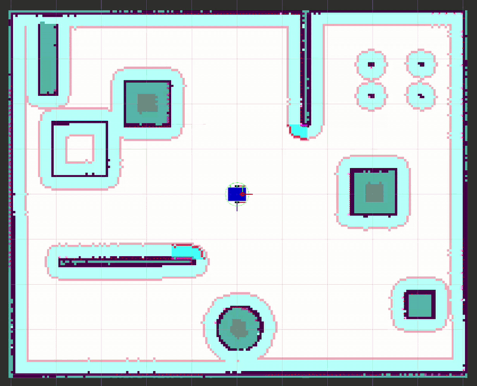

# ROS 2 Robotics Learning

A self-directed path through ROS 2, from a first `rclpy` publisher to a
differential-drive robot that maps a room with `slam_toolbox` and then navigates
it autonomously with Nav2.



Three goals clicked in RViz, at roughly 7× real time. Everything after each
click is the robot's own: localizing against its own saved map, planning a
route, and driving it. The first goal sits behind an interior wall, so the
planner has to commit to a detour — the case that made the default local
controller fail, and the reason this project runs Regulated Pure Pursuit
instead. [The full story →](src/my_robot_description/README.md#controller-choice-dwb-to-rpp)

Guided by Prof. Liu Shuang's suggestion to start with ROS/Linux and work up to
a multi-beam LiDAR robot with path planning.

The habit this repo is really practising is **verifying rather than assuming**.
Mass and inertia in the URDF are derived from geometry instead of guessed. The
saved map's dimensions are checked against the world file. The LiDAR's blind
spots — the tabletop it passes under, the low platform it skims over — were
predicted from the sensor's vertical geometry *before* they showed up in the
occupancy grid, and the numbers matched. Several of the hardest bugs produced
no error message at all; they were found by hand-checking values that looked
plausible.

## What's in here

| Package | What it is |
|---|---|
| [`my_robot_description`](src/my_robot_description) | The main project — URDF robot, Gazebo world, 16-beam LiDAR, 2D SLAM, saved map, Nav2 autonomous navigation. **[Full write-up →](src/my_robot_description/README.md)** |
| [`my_first_pkg`](src/my_first_pkg) | ROS 2 fundamentals: publisher/subscriber, service/client, parameters, launch files |
| [`my_first_pkg_interfaces`](src/my_first_pkg_interfaces) | A custom service definition (`CheckBattery.srv`) used by `my_first_pkg` |
| [Linux 与 ROS 2 自学笔记](Linux与ROS2自学笔记.md) | Study notes in Chinese — 8 days of Linux fundamentals, then ROS 2 core concepts |

## The main project

A differential-drive mobile robot built from scratch and simulated in a
purpose-built 10 m × 8 m indoor room: it maps the room with `slam_toolbox`, then
navigates it autonomously on that map with Nav2.

- **Custom URDF** — chassis, two driven wheels, two passive casters, LiDAR mount
- **Derived mass/inertia**, not tuned by trial and error
- **Differential drive** consuming `/cmd_vel`, publishing `/odom` and TF
- **16-beam GPU LiDAR** (VLP-16-like) publishing both `LaserScan` and `PointCloud2`
- **2D SLAM** with loop closure, and a saved grid
- **Nav2 autonomous navigation** on that grid — AMCL, dual costmaps, NavFn
  planning, Regulated Pure Pursuit control — with every parameter derived from
  this robot's geometry and this room's tightest passage rather than copied
- **Wheel-slip detection** from `/scan`, because the wheel encoders report
  normal motion during a slip and no Nav2 layer notices
- **Automated physics diagnostic** comparing wheel odometry against Gazebo
  ground truth — 1.08 % displacement error over a 3.90 m path

Three results worth calling out, all documented in detail in the package README:

**The 2D map is a slice, and it shows.** Objects were deliberately placed at
heights that straddle the LiDAR's beam envelope. The overhead beam is absent
from the map (0.0 % occupancy) and the table appears as legs only (4.1 %) —
consequences of sampling the world at a single height, not coverage gaps.


**A 0.26 mm mechanical tolerance was aiming the LiDAR.** Two subsystems, each
defensible on its own: the caster clearance (5 mm, chosen so the casters don't
steal traction from the driven wheels) and the beam elevation (+1°, inherited
from the VLP-16 spec, since 16 beams over ±15° leave none on the horizon).
Neither file mentions the other — but the robot rests nose-down on that
clearance, so their *sum* is where `/scan` actually points. It came to −0.909°,
putting the floor 11.40 m away inside a room whose diagonal is 12.81 m. The
design cleared its own requirement by 0.259 mm of caster clearance. Shrinking
the clearance to 3.5 mm moves the floor intersection to 31.0 m — beyond the
sensor's own 30 m range limit, so floor returns became impossible rather than
merely unlikely. Predicted 1.33666° resting pitch, measured 1.33659°.

**Five plausible fixes, all disproved by their own tests.** Nav2's default local
controller drove fine in open space but stalled whenever a goal sat behind an
interior wall, logging `No valid trajectories out of 419!`. Five hypotheses were
formed and each was tested rather than assumed — the progress checker, reverse
motion, costmap size, the goal critics, path alignment. All five were wrong, and
two were instructive: the goal-critic scores turned out to have the opposite
sign from what I had reasoned, and the path-alignment change *improved the
metric it targeted while making the outcome worse*. The real problem was
structural, not a tuning value, and switching to Regulated Pure Pursuit resolved
it. The disproved hypotheses are kept in the write-up, because which fixes
didn't work is the part that took the time.

The earlier stage — the same robot in the original obstacle world, with the raw
16-beam point cloud in RViz, before the room and SLAM existed:


## Build

Requires **ROS 2 Jazzy** and **Gazebo Harmonic** (gz-sim).

This repository *is* the colcon workspace, so clone it and build in place:

```bash
git clone git@github.com:jianzqi123/ROS2-robotics-learning.git ros2_ws
```

```bash
cd ros2_ws && colcon build && source install/setup.bash
```

Then follow the [run instructions](src/my_robot_description/README.md#run-it)
for the simulation, SLAM, teleoperation, and
[autonomous navigation](src/my_robot_description/README.md#autonomous-navigation)
terminals.

## Roadmap

- [x] Linux fundamentals and ROS 2 core concepts
- [x] Custom URDF with derived physics, differential drive, 16-beam LiDAR
- [x] Purpose-built indoor world and Gazebo simulation
- [x] 2D SLAM with `slam_toolbox`, occupancy grid saved for Nav2
- [x] Nav2 integration — AMCL localization against the saved map, then
      autonomous path planning, goals set from RViz
- [x] Slip detection and localization recovery, since wheel odometry cannot
      see a slip and no Nav2 layer reports one
- [ ] Open items are tracked in
      [Known Issues](src/my_robot_description/README.md#known-issues--next-steps)
