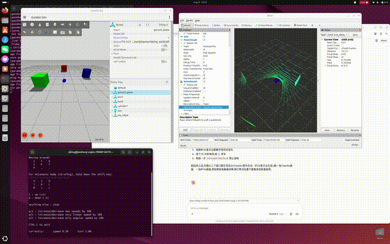

# ROS 2 Robotics Learning

A self-directed path through ROS 2, from a first `rclpy` publisher to a
differential-drive robot mapping a room with `slam_toolbox`.


Guided by Prof. Liu Shuang's suggestion to start with ROS/Linux and work up to
a multi-beam LiDAR robot with path planning.

The habit this repo is really practising is **verifying rather than assuming**.
Mass and inertia in the URDF are derived from geometry instead of guessed. The
saved map's dimensions are checked against the world file. The LiDAR's blind
spots — the tabletop it passes under, the low platform it skims over — were
predicted from the sensor's vertical geometry *before* they showed up in the
occupancy grid, and the numbers matched. Several of the hardest bugs produced
no error message at all; they were found by hand-checking values that looked
plausible.

## What's in here

| Package | What it is |
|---|---|
| [`my_robot_description`](src/my_robot_description) | The main project — URDF robot, Gazebo world, 16-beam LiDAR, 2D SLAM, saved map. **[Full write-up →](src/my_robot_description/README.md)** |
| [`my_first_pkg`](src/my_first_pkg) | ROS 2 fundamentals: publisher/subscriber, service/client, parameters, launch files |
| [`my_first_pkg_interfaces`](src/my_first_pkg_interfaces) | A custom service definition (`CheckBattery.srv`) used by `my_first_pkg` |
| [Linux 与 ROS 2 自学笔记](Linux与ROS2自学笔记.md) | Study notes in Chinese — 8 days of Linux fundamentals, then ROS 2 core concepts |

## The main project

A differential-drive mobile robot built from scratch and simulated in a
purpose-built 10 m × 8 m indoor room, producing an occupancy grid with
`slam_toolbox`.

- **Custom URDF** — chassis, two driven wheels, two passive casters, LiDAR mount
- **Derived mass/inertia**, not tuned by trial and error
- **Differential drive** consuming `/cmd_vel`, publishing `/odom` and TF
- **16-beam GPU LiDAR** (VLP-16-like) publishing both `LaserScan` and `PointCloud2`
- **2D SLAM** with loop closure, and a saved grid ready for Nav2
- **Automated physics diagnostic** comparing wheel odometry against Gazebo
  ground truth — 1.08 % displacement error over a 3.90 m path

Two results worth calling out, both documented in detail in the package README:

**The 2D map is a slice, and it shows.** Objects were deliberately placed at
heights that straddle the LiDAR's beam envelope. The overhead beam is absent
from the map (0.0 % occupancy), the table appears as legs only (4.1 %), and the
low platform resolves as a hollow outline (11.8 %) — each one a predicted
consequence of sampling the world at a single height, not a coverage gap.

**`/scan` is tilted 1° upward, and can't not be.** With 16 beams over ±15°, no
beam lands on the horizon; `ros_gz_bridge` flattens the 3D scan by taking the
middle row, which is the +1° beam. This was found by reading the bridge's
source, and it quantitatively predicts the hollow platform outline above.

The earlier stage — the same robot in the original obstacle world, with the raw
16-beam point cloud in RViz, before the room and SLAM existed:



## Build

Requires **ROS 2 Jazzy** and **Gazebo Harmonic** (gz-sim).

This repository *is* the colcon workspace, so clone it and build in place:

```bash
git clone git@github.com:jianzqi123/ROS2-robotics-learning.git ros2_ws
```

```bash
cd ros2_ws && colcon build && source install/setup.bash
```

Then follow the [run instructions](src/my_robot_description/README.md#run-it)
for the simulation, SLAM, and teleoperation terminals.

## Roadmap

- [x] Linux fundamentals and ROS 2 core concepts
- [x] Custom URDF with derived physics, differential drive, 16-beam LiDAR
- [x] Purpose-built indoor world and Gazebo simulation
- [x] 2D SLAM with `slam_toolbox`, occupancy grid saved for Nav2
- [ ] Nav2 integration — AMCL localization against the saved map, then
      autonomous path planning
- [ ] Open items are tracked in
      [Known Issues](src/my_robot_description/README.md#known-issues--next-steps)
