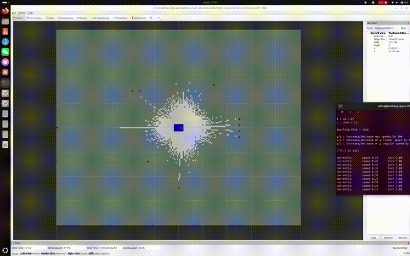

# My Robot Description

A differential-drive mobile robot with a 16-beam 3D LiDAR, built from scratch in
ROS 2 Jazzy and Gazebo Harmonic, running 2D SLAM with `slam_toolbox`.

## Overview

This project models a mobile robot end to end — mechanical structure (URDF),
physics (mass/inertia, collision, ground contact), differential-drive control,
a 16-beam 3D LiDAR — simulates it in a purpose-built indoor world, and closes
the loop by producing an occupancy grid map with `slam_toolbox`.

Built as part of self-directed ROS 2 study, guided by Prof. Liu Shuang's
suggestion to start with ROS/Linux and work up to a multi-beam LiDAR robot
with path planning.

The emphasis throughout has been on **verifying rather than assuming**: every
geometric constant in the URDF and world file is derived, cross-checked, and
documented inline. Several of the bugs listed at the bottom were found by
hand-checking numbers that looked plausible but weren't.

## Features

- **Custom URDF**: chassis, two driven wheels, two passive casters, LiDAR mount
- **Derived mass/inertia** — computed from geometry, not guessed
  (wheel `izz = ½mr²`, `ixx = iyy = (1/12)m(3r² + h²)`)
- **Differential drive** via `gz-sim-diff-drive-system`, consuming `/cmd_vel`,
  publishing `/odom` and the `odom → base_link` TF
- **16-beam GPU LiDAR** (VLP-16-like: ±15° vertical, 360° horizontal, 10 Hz)
  publishing both `sensor_msgs/LaserScan` (`/scan`) and
  `sensor_msgs/PointCloud2` (`/scan/points`)
- **Purpose-built indoor world**: 10 m × 8 m walled room with internal walls,
  plus objects at deliberately chosen heights to exercise the 3D LiDAR
- **2D SLAM** with `slam_toolbox` (async, Ceres solver, loop closure enabled)
- **Saved occupancy grid** ready for Nav2 (`maps/my_map.yaml` + `.pgm`)
- **Automated physics diagnostic** (`scripts/teleport_test.py`) that drives a
  fixed motion sequence and compares wheel odometry against Gazebo ground truth

## Tech Stack

ROS 2 Jazzy · Gazebo Harmonic (gz-sim) · URDF/SDF · `ros_gz_bridge` ·
`slam_toolbox` · `nav2_map_server` · `nav2_lifecycle_manager` · RViz2

## Demo



A teleoperated mapping run, seen top-down in RViz: 5 min 20 s of simulated time
from an empty grid to the finished occupancy map, with the live `/scan` points
spraying out ahead of the robot as it goes.

The final frame is worth pausing on, because it shows the sensor's limits as
plainly as its coverage. The two 1 m boxes and the shelf fill in solid.
`table1` leaves only a scatter of **leg dots** where its top should be.
`overhead_beam` never appears **at all**. Both of those follow directly from
the LiDAR's vertical geometry — see
[Results](#the-2d-map-is-a-slice-and-it-shows) for the numbers. The 0.25 m
`platform` resolves as a **hollow outline**, which was predicted too, but for a
reason that later turned out to be wrong; the caveats in that section explain
why.

Recorded with the original 5 mm caster clearance, before the `/scan` elevation
was corrected from −0.909° to −0.337° — so this is a record of the geometry
described in [Design Notes](#a-mechanical-clearance-silently-aims-the-sensor),
not of the current one.

An [earlier build](demo_lidar.gif) — before the room world and SLAM — shows the
same robot in the original obstacle world with the raw 16-beam point cloud in
RViz.

## Repository Layout

```
my_robot_description/
├── urdf/my_robot.urdf           # robot model + DiffDrive / JointState / LiDAR plugins
├── worlds/my_world.sdf          # 10×8 m indoor room with 3D structure
├── launch/
│   ├── gazebo.launch.py         # Gazebo + robot spawn + ros_gz_bridge
│   └── slam.launch.py           # slam_toolbox + lifecycle manager + RViz
├── config/slam_params.yaml      # slam_toolbox tuning
├── rviz/slam.rviz               # RViz layout (map / scan / TF / robot)
├── maps/                        # saved occupancy grid
│   ├── my_map.yaml
│   └── my_map.pgm
├── scripts/teleport_test.py     # automated physics-stability diagnostic
├── demo_map.gif                 # SLAM mapping run (Demo section above)
├── demo_lidar.gif               # earlier build: raw 16-beam point cloud
├── package.xml                  # dependencies — keep in sync with the launch files
├── setup.py                     # installs urdf/worlds/config/rviz/launch/maps to share/
└── README.md                    # this file
```

## Run it

Build:

```bash
cd ~/ros2_ws
colcon build --packages-select my_robot_description
source install/setup.bash
```

Terminal 1 — simulation:

```bash
ros2 launch my_robot_description gazebo.launch.py
```

Terminal 2 — SLAM (also opens RViz):

```bash
ros2 launch my_robot_description slam.launch.py
```

Terminal 3 — teleoperation:

```bash
ros2 run teleop_twist_keyboard teleop_twist_keyboard
```

Press `x` nine times to bring the speed down from 0.50 to ≈0.19 m/s before
driving. Follow the perimeter first, then the interior, then return near the
origin so `slam_toolbox` can close the loop.

Save the map when coverage looks complete:

```bash
# Nav2 occupancy grid — this is what Nav2 consumes later
ros2 run nav2_map_server map_saver_cli -f src/my_robot_description/maps/my_map \
  --ros-args -p save_map_timeout:=10000.0 -p use_sim_time:=true

# slam_toolbox pose graph — for resuming mapping or relocalizing.
# Not committed: ~23 MB binary. Regenerate with this command when needed.
ros2 service call /slam_toolbox/serialize_map \
  slam_toolbox/srv/SerializePoseGraph \
  "{filename: '/home/$USER/maps/my_map_posegraph'}"
```

## Results

### Odometry accuracy

`scripts/teleport_test.py` drives a fixed 34 s sequence (straight runs, hard
stops, in-place rotation, an arc, a hard acceleration) and compares wheel
odometry against Gazebo's ground-truth pose:

| Metric | Theoretical | Measured |
|---|---|---|
| `/odom` messages (50 Hz × 34 s) | 1700 | 1702 |
| Path length | 3.90 m | **3.90 m** |
| Net displacement error | — | 0.042 m (**1.08 %** of path) |
| Net heading error | — | 0.2° (**0.15 %** of 129.4° net rotation) |
| Teleport events | — | 0 |

Path length matching exactly means the simulation dropped no frames and ran at
full real-time. The displacement check compares **vectors**, not distances — a
reversed drive direction has the same magnitude and would otherwise pass.

### Map quality

The saved grid is 203 × 163 cells at 0.05 m/px:

| Metric | Value | Ground truth |
|---|---|---|
| Map extent | 10.15 m × 8.15 m | 10 m × 8 m interior + 0.15 m wall |
| Aspect ratio | 1.2454 | 1.2500 (0.37 % error) |
| Wall completeness | 100 % on all four walls | — |
| Scale anisotropy | 0.00 % | — |

`origin: [-5.061, -4.066, 0]` puts the grid edges at ±5.089 / ±4.084 — exactly
one wall thickness outside the ±5.0 / ±4.0 interior, which is where the LiDAR
sees the inner wall surface. Zero scale anisotropy indicates loop closure
converged; a map with unclosed drift stretches along the travel direction.

### The 2D map is a slice, and it shows

The objects in the world were placed at heights chosen to test exactly this.
Measured occupancy in each object's footprint:

| Object | Height | Predicted in 2D map | Measured |
|---|---|---|---|
| `box1` (control) | 1.0 m | full | 50.6 % |
| `box2` (control) | 1.0 m | full | 71.1 % |
| `overhead_beam` | 1.1–1.3 m | **absent** | **0.0 %** |
| `table1` | top at 0.73 m | **legs only** | **4.1 %** |
| `platform` | 0.25 m | **outline only** | **11.8 %** |

The beam passes under the overhead beam, and under the tabletop but through the
legs. Those two rows are solidly explained by beam height alone, and they are
the point of the section: these are not gaps in coverage, they are the
consequences of sampling the world at one height.

> **Two caveats, both discovered after these numbers were taken.**
>
> **1. The `platform` row's explanation was wrong.** Earlier versions of this
> file said the beam passed *over* the 0.25 m platform beyond 3.72 m, computed
> from an assumed `+1°` upward tilt. But the net elevation was `−0.909°` —
> pointing *down* — so a beam leaving the LiDAR at 0.181 m only ever gets
> lower and cannot clear a 0.25 m obstacle at any range. The 11.8 % is real;
> the reason given for it was not. A 2D scan marks only the outer perimeter of
> a solid box (≈16 % of a 1.2 m × 1.2 m footprint at 0.05 m/cell), which is the
> right order of magnitude, but it does not explain why `box1` reads 50.6 %
> under the same logic. **Unresolved — needs the measurement script re-run and
> the metric's definition pinned down.**
>
> **2. These were measured with the original 5 mm caster clearance**, i.e. at a
> net `/scan` elevation of `−0.909°`. The current geometry is `−0.337°`, so the
> map should be regenerated before these figures are quoted again. The saved
> `maps/my_map.pgm` and the demo GIF are both from the earlier geometry.

## Design Notes

Every number below is derived rather than tuned by trial and error. The inline
comments in `my_robot.urdf` and `my_world.sdf` carry the same reasoning.

### Wheel joint axis

The wheel joints use `rpy="1.5708 0 0"`, which maps the child frame's `z` axis
onto the parent's **−Y**. Differential drive expects a wheel spinning about
**+Y** to move the robot forward (for a wheel of radius `R` spinning at `ω`
about +Y, the contact point constraint gives `v = ωR`). The axis is therefore
declared as:

```xml
<axis xyz="0 0 -1"/>
```

Getting this sign wrong is quietly destructive: the robot drives backwards
*and* the odometry agrees with itself the whole time, so nothing looks broken
until you compare against ground truth.

### Ground contact: three-point, not four

Two driven wheels alone let the chassis pitch about the wheel axle until a
corner of the chassis box scrapes the floor. Two spherical casters fix that,
but their height matters:

| | value |
|---|---|
| Wheel contact plane | `z = −0.100 m` |
| Caster lowest point | `z = −0.0965 m` |
| Clearance | **3.5 mm** |
| Pitch before a caster touches | `atan(0.0035 / 0.15) = 1.337°` |
| Pitch before the chassis corner touches | `atan(0.05 / 0.20) = 14.04°` |

The casters must not be coplanar with the wheels. Normal-load distribution
across four contact points would be statically indeterminate; the casters (with
friction zeroed) would absorb load the driven wheels need for traction and
lateral constraint, and the robot would understeer badly.

Caster friction is set to zero (`mu1 = mu2 = 0`) because they are attached with
`fixed` joints and cannot roll; any friction there would fight every turn.

### The front caster is load-bearing at rest — it is not a spare

This file used to claim the casters "contribute nothing in normal driving".
That is false, and measuring it is what exposed the `/scan` geometry problem
below.

The 0.3 kg LiDAR sits at `x = +0.12`, which puts the centre of mass 5.6 mm
ahead of the wheel axle (`0.3 × 0.12 / 6.4 kg`). Nothing balances it, so the
chassis always tips forward until the front caster touches, and stops exactly
there — *every* time, not just under braking. Spawning the model and reading
Gazebo's ground-truth pose once it settles gives an orientation quaternion of
`y = 0.0116637, w = 0.9999320`, i.e. a pitch of `2·atan2(y, w)`:

| | value |
|---|---|
| Predicted caster contact angle | `atan(0.0035 / 0.15)` = **1.33666°** |
| Measured resting pitch | **1.33659°** (0.005 % off) |
| Measured chassis height | 0.099986 m (wheel contact puts it at 0.100 m) |

The clearance is 3.5 mm rather than the 5 mm it started at, and the reason is
entirely about where this pitch aims the LiDAR — see below.

### LiDAR vertical geometry

The LiDAR sits at **z = 0.185 m** above the floor (base_link origin is 0.100 m
up, LiDAR mount adds 0.085 m). With a ±15° vertical spread, the vertical
coverage at range `r` is approximately `0.185 ± 0.268·r` — about `[0, 0.99] m`
at 3 m and `[0, 1.53] m` at 5 m. The world's objects are sized against that
envelope (see the Results table above for measured outcomes).

### `/scan` is not perfectly horizontal — and can't be, with 16 beams

This one is worth stating explicitly because it is invisible until you go
looking for it.

With `samples = 16` over `[−15°, +15°]`, gz-sensors computes the step as
`(vMax − vMin) / (vSamples − 1) = 30° / 15 = 2°`, placing beams at
−15°, −13°, … , −1°, **+1°**, … , +15°. **An even beam count means no beam
lies exactly on the horizon.**

`ros_gz_bridge` flattens the 3D scan into a 2D `LaserScan` by taking the middle
vertical row — `start = (vertical_count / 2) * count`, i.e. integer index 8,
which is the **+1.000°** beam. So `/scan`, the topic `slam_toolbox` actually
consumes, is tilted 1° upward.

That +1° is measured in the LiDAR's own frame. **The chassis does not sit
level**, so it is not what `/scan` does in the world:

```
net elevation = +1.000° (beam)  −  1.337° (resting pitch)  =  −0.337°
```

The scan points slightly *down*, not up.

### A mechanical clearance silently aims the sensor

The resting pitch and the beam elevation are the same magnitude in opposite
directions, which means **the caster clearance — a number chosen for contact
reasons — is what actually decides where `/scan` points.** Nothing in either
subsystem's documentation mentions the other.

Working the coupling through, with the LiDAR's height recomputed at each pitch
(it sits at `x = +0.12`, so tipping forward lowers it):

| Caster clearance | Resting pitch | Net `/scan` elevation | Beam reaches floor at |
|---|---|---|---|
| 5.0 mm (original) | 1.909° | −0.909° | **11.40 m** |
| 4.741 mm (critical) | 1.809° | −0.809° | 12.81 m — the room diagonal |
| **3.5 mm (current)** | **1.337°** | **−0.337°** | **31.0 m** |

The room's diagonal is 12.806 m and the LiDAR's max range is 30 m.

At the original 5 mm the beam met the floor at 11.40 m — *inside the room*. The
longest sight lines could return floor points instead of walls. The finished
map came out clean only because nearly every wall is nearer than 11.40 m from
nearly every position: the design cleared its own requirement by **0.259 mm of
caster clearance**, which is not a margin worth relying on.

At 3.5 mm the intersection moves to 31.0 m — past the sensor's own 30 m range
limit. The beam therefore *cannot* return a floor point, and that guarantee no
longer depends on the room being small enough. Verified against a running sim:
measured resting pitch **1.33659°** against **1.33666°** predicted, 0.005 % off.

A slightly descending beam was chosen deliberately over a level or ascending
one. An ascending beam passes over low obstacles beyond some range and stops
reporting them, which for Nav2 is a collision. A descending beam never misses a
low obstacle; its only failure mode is striking the floor, and that has now been
pushed outside the sensor's range entirely.

The +1° beam itself is left alone, because it is not a modelling error: a real
VLP-16 also puts 16 beams at 2° spacing across ±15° and likewise has none on
the horizon. Flattening it would mean an odd beam count (15 beams → step
30°/14, middle index 7 on exactly 0°), an asymmetric range (−16°/+14°), or a
dedicated 2D LiDAR link with the 16-beam sensor kept for `/scan/points`. The
last is what real robots do and stays the right answer if `/scan` ever has to be
exactly horizontal — but at −0.337° net it is no longer urgent.

### World layout

Interior is 10 m × 8 m (`x ∈ [−5, 5]`, `y ∈ [−4, 4]`), walls 0.15 m thick and
1.5 m tall. Wall thickness is deliberate — thin walls are prone to tunnelling
under default contact solver settings. Two internal walls create corridors and
corners so scan matching has distinguishable features, but neither encloses a
region, so the robot can always drive a full circuit back to its start and give
loop closure something to work with. The 1.5 m radius around the spawn point is
kept clear so `teleport_test.py` can run its whole sequence in place (its
trajectory stays within 1.21 m of the origin, with 0.45 m of clearance to the
nearest wall).

## Debugging Log

The parts of this project that took the longest were not the parts that
produced errors.

**A silent sign error in the wheel axis.** Symptom: the robot moved, odometry
was smooth and self-consistent, nothing logged a warning — but the physical
motion in Gazebo disagreed with `/odom`. A joint's `rpy` rotates its `<axis>`,
so the axis has to be declared in the *child* frame after that rotation. This
led directly to the ground-truth comparison in `teleport_test.py`: odometry
that is internally consistent proves nothing, because DiffDrive is a velocity
controller and the wheels reach commanded speed whether or not they have
traction.

**"The robot teleports when it hits a wall" turned out to be two problems, and
neither was physics.** The investigation first ruled out inertia tensors
(checked against the triangle inequality and recomputed from geometry),
collision-geometry interpenetration, and DiffDrive parameter mismatch — all
fine. The free-space diagnostic then came back clean (0 events, 1.08 % error),
which narrowed it to contact. But watching Gazebo and RViz side by side showed
the physical robot sitting calmly against the wall while only the RViz robot
flew off: what was "teleporting" was the *estimate*, not the robot.

The mechanism is the velocity controller again. Blocked by a wall, the wheels
keep spinning at the commanded rate, so `/odom` integrates forward at
0.19 m/s into the wall indefinitely. Real robots have exactly this failure
mode; it is why odometry alone is never trusted.

The second problem was operator error: `w`/`x` adjust linear speed in
`teleop_twist_keyboard` and I had been pressing `w`, running at 2.53 m/s — 13×
the intended speed. At that rate one second of wheel slip produces 2.5 m of
odometry drift, far outside `slam_toolbox`'s default 0.5 m
`correlation_search_space_dimension`, so scan matching could never recover and
the map was corrupted. At 0.19 m/s, a 2-second stall drifts 0.38 m, inside the
window — and scan matching snaps the pose back as soon as the robot backs off.
The practical rule that falls out of this: **stalled contact must stay under
`0.5 / v` seconds** (2.6 s at 0.19 m/s) for SLAM to self-correct.

**Sensor pipeline debugging.** Gazebo's GPU LiDAR publishes `LaserScan` by
default; `PointCloud2` requires the separate `/scan/points` topic. Frame names
between the Gazebo sensor and the URDF link are reconciled with `gz_frame_id`.
Tracing a break in `sensor plugin → gz topic → ros_gz_bridge → ROS topic`
means checking each hop, not guessing at the ends.

**Reading the bridge's source instead of assuming.** The `/scan` tilt described
above was found by reading `ros_gz_bridge`'s `convert_gz_to_ros` for
`LaserScan` and gz-sensors' `VerticalAngleResolution()`, then recomputing the
beam table by hand. No log message would ever have mentioned it — and the
prediction it produced (a hollow platform outline beyond 3.72 m) was later
confirmed in the finished map.

**Undeclared dependencies bite exactly once.** `map_saver_cli` failed with
`Package 'nav2_map_server' not found` at the moment the map was ready to save.
`package.xml` had declared only `rclpy` — everything else had happened to be
installed already. See Known Issues.

**A test that cannot fail is not a test.** Verifying the new `/joint_states`
bridge produced three tempting "confirmations" in a row, and the first two were
worthless:

| Check | Result | Why it proves nothing |
|---|---|---|
| `parameter_bridge` starts without error | passes | Also passes with `gz.msgs.NotAThing` |
| ROS-side topic appears with the right type | passes | Publisher is built from the *ROS* type alone |
| Bridge logs `Creating GZ->ROS Bridge: [… (gz.msgs.Model) → …]` | passes | Log line echoes the string you typed |

Each was only recognised as vacuous by running the same check against a
deliberately invalid message type and watching it pass just as cleanly. The
only real evidence was `ros2 topic echo /joint_states` against a running
simulation, returning actual joint names and velocities. The habit worth
keeping: before believing a green check, ask what a broken system would print —
if the answer is "the same thing", the check is measuring nothing.

**The physics confirmed a number nobody had measured yet.** Reading Gazebo's
ground-truth pose during that verification showed the robot resting at a pitch
of 1.9091°, against the 1.9092° derived from caster clearance months earlier —
and revealed that this pitch is permanent rather than transient, which is a
real correction to what this file used to claim about the `/scan` tilt.

**Two subsystems, each correct, coupled through a number neither documents.**
The caster clearance was chosen for contact reasons: high enough not to steal
normal load from the driven wheels, low enough to catch the chassis before a
corner scrapes. The beam elevation was inherited from the VLP-16 spec. Neither
decision is wrong, and neither file mentions the other — but their *sum* is
where `/scan` actually points, and that sum put the floor 11.40 m away inside a
room whose diagonal is 12.81 m. The design met its own requirement by 0.259 mm
of caster clearance. Nothing in either subsystem would ever have flagged that;
it only appears when you multiply one by the other.

The fix that followed is worth recording because the obvious one was wrong.
Moving the LiDAR onto the wheel axle would zero the 5.6 mm centre-of-mass
offset and let the robot rest level — but a robot balanced *exactly* on its
wheel line is in neutral equilibrium, and would tip onto whichever caster the
landing noise favoured, replacing a deterministic 1.9° tilt with a
nondeterministic ±1.3° one. Keeping the mass deliberately forward and shrinking
the *travel* instead keeps the resting attitude repeatable. Balance was the
intuitive fix; determinism was the useful one.

## Known Issues / Next Steps

- [x] ~~**`/joint_states` is not bridged from Gazebo.**~~ Fixed:
  `gz-sim-joint-state-publisher-system` added to the URDF with an explicit
  `<topic>joint_states</topic>`, bridged as
  `sensor_msgs/msg/JointState[gz.msgs.Model`, and the competing
  `joint_state_publisher` node removed from `gazebo.launch.py`. Verified end to
  end against a running sim — `/joint_states` now carries live
  `left_wheel_joint` / `right_wheel_joint` position, velocity and effort.
- [x] ~~**Bridge directions are all bidirectional (`@`).**~~ Fixed: `/cmd_vel`
  is now ROS→Gazebo (`]`), and `/odom`, `/scan`, `/scan/points`, `/tf` and
  `/joint_states` are Gazebo→ROS (`[`).
- [x] ~~**`package.xml` declares only `rclpy`.**~~ Fixed: all eleven runtime
  packages declared, plus the message packages `teleport_test.py` imports.
  Description and license filled in.
- [x] ~~**Decide how to handle the 1° `/scan` tilt.**~~ Resolved by shrinking
  the caster clearance from 5.0 mm to 3.5 mm, which cuts the resting pitch from
  1.909° to 1.337° and moves the net `/scan` elevation from −0.909° to −0.337°.
  The beam now meets the floor at 31.0 m, past the sensor's own 30 m range
  limit, so floor returns are impossible rather than merely unlikely. The +1°
  beam is deliberately left alone — it matches a real VLP-16. Verified against
  a running sim: 1.33659° measured against 1.33666° predicted.
- [ ] **Regenerate the map and re-measure the slice table.** `maps/my_map.pgm`,
  `demo_map.gif` and every figure in [Results](#results) were produced at the
  old −0.909° elevation. Nav2 should localize against a map built with the
  geometry it will actually run.
- [ ] **Re-derive the `platform` occupancy figure.** The 11.8 % is measured and
  real; the explanation this file gave for it was wrong (see the caveat in the
  slice section), and the perimeter-only account that replaces it does not
  explain `box1` at 50.6 %. Needs the measurement script re-run with the
  metric's definition stated.
- [ ] `map_saver_cli` logs a default `free_thresh` of 0.25 but writes 0.196 to
  the YAML. The YAML value is what AMCL will read — worth knowing before
  tuning localization.
- [x] ~~Record a new demo GIF (the existing one predates the SLAM work).~~
  Done — `demo_map.gif`, see [Demo](#demo).
- [ ] Nav2 integration: AMCL localization against the saved map, then
  autonomous navigation.
